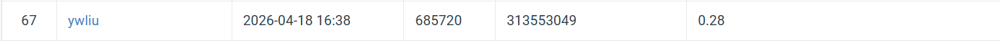

# NYCU Selected Topics in Visual Recognition using Deep Learning 2026 — Homework 2

* **Student ID**: 313553049
* **Name**: 劉怡妏

## Introduction

This repository contains the implementation for HW2: **Digit Detection** on the Street View House Numbers (SVHN) dataset using **DAB-DETR** with a ResNet-50 backbone.

The final submission uses a **two-model weighted box fusion (WBF) ensemble**:

* **Model A (v1)**: Trained with 256×256 stretch resize, ColorJitter augmentation, standard DETR loss weights
* **Model B (v2)**: Trained with 320×320 letterbox resize (aspect-ratio preserving), heavier GIoU loss weighting (`GIOU=4.0`, `MATCH_GIOU=5.0`), lower inference threshold

## File Structure

```
.
├── train.py           # Training loop, loss, inference entry point
├── models.py          # DAB-DETR model architecture
├── datasets.py        # Dataset, letterbox transform, collate function
├── wbf_ensemble.py    # WBF ensemble of two pred.json files
├── nycu-hw2-data/
│   ├── train/         # Training images
│   ├── valid/         # Validation images
│   ├── test/          # Test images (unlabelled)
│   ├── train.json     # COCO-format training annotations
│   └── valid.json     # COCO-format validation annotations
```

## Environment Setup

### Requirements

* Python 3.9+
* CUDA-compatible GPU (RTX 3060 Ti 8 GB or better recommended)

### Installation

```bash
pip install torch torchvision --index-url https://download.pytorch.org/whl/cu118
pip install pycocotools scipy ensemble-boxes pillow numpy
```

## Usage

### 1. Training

**Train Model A (v1) — 256×256 stretch resize:**

```bash
python train.py --version v1
```

**Train Model B (v2) — 320×320 letterbox resize:**

```bash
python train.py --version v2
```

**Resume training from a checkpoint:**

```bash
python train.py --version v1 --resume --ckpt best_model_v1.pth
python train.py --version v2 --resume --ckpt best_model_v2.pth
```

Checkpoints are saved automatically whenever val mAP improves. Each checkpoint includes the full training state (model weights, optimizer, scheduler, AMP scaler, and current best mAP) to allow seamless resumption.

### 2. Inference

Run inference with each model separately to produce two prediction files:

```bash
# Model A inference
python train.py --infer --version v1 --ckpt best_model_v1.pth
mv pred.json pred_log1.json

# Model B inference
python train.py --infer --version v2 --ckpt best_model_v2.pth
mv pred.json pred_log2.json
```

Each `pred.json` is a COCO-format list where every entry contains `image_id`, `category_id`, `bbox` (in `[x, y, w, h]` pixel format), and `score`.

### 3. WBF Ensemble

Merge the two prediction files using Weighted Box Fusion:

```bash
python wbf_ensemble.py
```

This reads `pred_log1.json` and `pred_log2.json`, applies WBF with weights `[2, 1]` (Model A weighted higher), `iou_thr=0.55`, and `skip_box_thr=0.05`, then writes the final `pred.json`.

## Performance Snapshot


